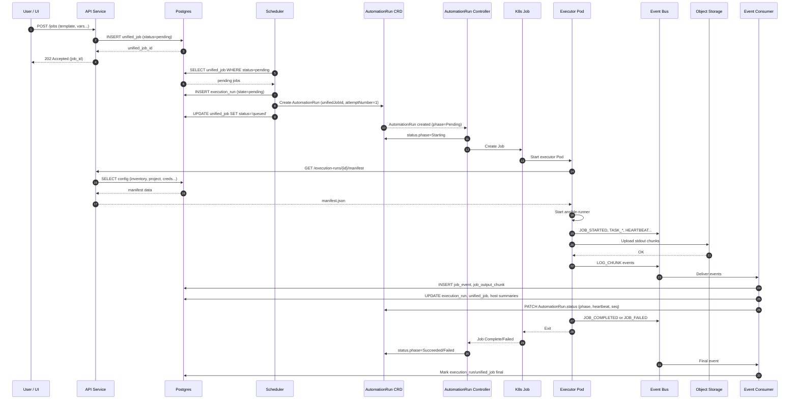
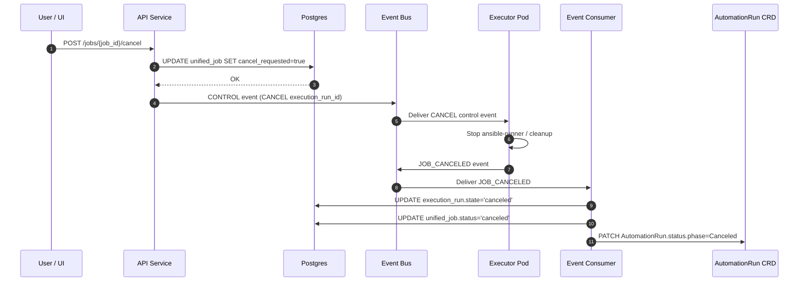
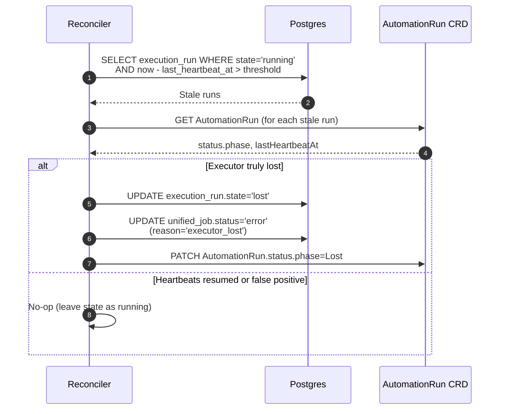

# Resilient Ansible Automation Platform – Architecture

This document describes the architecture of a Kubernetes-based, resilient Ansible automation platform that:

- Runs long-lived Ansible playbooks and workflows.
- Survives control-plane database (DB) failovers and brief outages without failing jobs.
- Provides rich observability (per-host, per-task events and logs).
- Scales horizontally across multiple execution nodes.

It builds on the **vision** of decoupling execution from the control-plane database using an **event-driven** design, and then grounds that vision in a **Kubernetes-native** implementation.

---

## 1. High-Level Architecture

### 1.1 Logical Overview

The system is composed of three main parts:

1. **Control Plane (Application-level, DB-centric)**
   - API Service
   - Scheduler
   - Event Consumer
   - Reconciler
   - Postgres (HA)

2. **Execution Plane (Kubernetes-based, DB-independent)**
   - AutomationRun CRDs
   - AutomationRun Controller
   - Kubernetes Jobs and Executor Pods (Ansible runners)

3. **Backbone Services**
   - Event Bus (Kafka / NATS / Redpanda)
   - Object Storage (S3 / MinIO)

**Key principle:**  
Execution must not depend on the real-time availability of the control-plane database. The **event stream** is the source of truth for execution, and the DB is an eventually-consistent projection of that stream.

### 1.2 Component Diagram (Mermaid)

```mermaid
flowchart LR
    %% Style / Groups
    subgraph ext[External]
        U[User / CLI / UI]
    end

    subgraph cp[Control Plane]
        API[API Service]
        SCHED[Scheduler]
        DB[(Postgres)]
        EC[Event Consumer]
        REC[Reconciler]
    end

    subgraph k8s[Kubernetes Cluster]
        subgraph crds[CRDs]
            AR[AutomationRun CR]
        end

        subgraph exec[Execution Layer]
            JR[K8s Job]
            POD[Executor Pod<br/>(ansible-runner)]
        end

        subgraph infra[Cluster Services]
            EB[(Event Bus<br/>(Kafka/NATS))]
            OBJ[(Object Storage<br/>(S3/MinIO))]
        end
    end

    %% User interactions
    U -->|Launch job (REST/gRPC)| API
    U -->|Query status/logs| API

    %% Control plane DB usage
    API -->|CRUD config, create unified_job| DB
    SCHED -->|Read pending unified_job| DB
    EC -->|Persist events, update job state| DB
    REC -->|Read job/heartbeat state| DB
    REC -->|Update job/run status| DB

    %% Scheduler + CRD
    SCHED -->|Create AutomationRun| AR
    SCHED -->|Create execution_run row| DB

    %% CRD controller to Jobs/Pods
    AR -->|Watched by<br/>AutomationRun Controller| JR
    JR --> POD

    %% Executor Pod behavior
    POD -->|Fetch manifest<br/>(unified_job / execution_run)| API
    POD -->|Emit job/task events,<br/>heartbeats| EB
    POD -->|Upload log chunks| OBJ

    %% Event consumer from bus to DB & CRD
    EB --> EC
    EC -->|Write job_event,<br/>job_output_chunk,<br/>host_summary| DB
    EC -->|Update status/heartbeat| AR

    %% Reconciler using DB + CRDs
    AR -->|Read AutomationRun state| REC
    REC -->|Mark lost / reconcile<br/>AutomationRun phase| AR

    %% Logs path to user
    API -->|Read log index<br/>(job_output_chunk)| DB
    API -->|Stream log chunks| OBJ
```

---

## 2. Data Model

The data model is inspired by AWX/AAP but adjusted to enforce separation between configuration (control plane) and execution (runtime).

### 2.1 Configuration & Templates (Control Plane, DB-centric)

Stored in Postgres, largely unchanged conceptually from AWX:

- Organizations, RBAC
  - `organization`, `team`, `user`, `setting`
- Inventories
  - `inventory`, `host`, `group`, `inventory_source`, `inventory_update`
- Credentials
  - `credential_type`, `credential`, `credential_input_source`, `execution_environment`
- Projects & SCM
  - `project`, `project_update`
- Job Templates & Workflows
  - `unified_job_template`, `job_template`, `workflow_job_template`, `workflow_job_template_node`
- Execution Infrastructure
  - `instance`, `instance_group`, `instance_link`
- Schedules, Notifications, etc.

These are **not** in the hot execution path and can assume the DB is the primary store.

### 2.2 Logical Job: `unified_job`

`unified_job` is the high-level representation of a job (like AWX’s `unified_job`), with concrete subtypes:

- `job` (playbook run)
- `project_update`
- `inventory_update`
- `workflow_job`
- etc.

Key fields (simplified):

```sql
unified_job (
    id                  BIGSERIAL PRIMARY KEY,
    unified_job_template_id BIGINT NOT NULL,
    status              TEXT NOT NULL,   -- pending, queued, running, successful, failed, canceled, error
    created_at          TIMESTAMPTZ NOT NULL DEFAULT now(),
    started_at          TIMESTAMPTZ,
    finished_at         TIMESTAMPTZ,
    cancel_requested    BOOLEAN NOT NULL DEFAULT FALSE,
    -- plus references to inventory, project, credentials, etc.
);
```

**Important:**  
`unified_job.status` is updated only by:

- Scheduler (pending → queued).
- Event Consumer (queued → running → final state).
- Reconciler (running → error/lost if needed).

Executors never directly update this table.

### 2.3 Physical Execution Attempt: `execution_run`

`execution_run` models a concrete attempt to run a `unified_job`. It is the primary identity for executor Pods.

```sql
CREATE TABLE execution_run (
  id                      UUID PRIMARY KEY,         -- run_id
  unified_job_id          BIGINT NOT NULL REFERENCES unified_job(id),
  attempt_number          INT NOT NULL DEFAULT 1,   -- retries later
  executor_instance_id    BIGINT NULL,              -- FK to instance/worker node
  created_at              TIMESTAMPTZ NOT NULL DEFAULT now(),
  started_at              TIMESTAMPTZ,
  finished_at             TIMESTAMPTZ,
  state                   TEXT NOT NULL DEFAULT 'pending',
                          -- 'pending', 'starting', 'running',
                          -- 'successful', 'failed', 'canceled', 'lost'
  last_heartbeat_at       TIMESTAMPTZ,
  last_event_seq          BIGINT NOT NULL DEFAULT 0,  -- highest seq seen from executor
  persisted_event_seq     BIGINT NOT NULL DEFAULT 0   -- highest seq successfully persisted in DB
);

CREATE INDEX ON execution_run (unified_job_id);
```

Executors identify themselves via `execution_run.id` and **never** mutate DB state directly; they only emit events.

### 2.4 Execution Events: `job_event`

`job_event` is an **append-only** projection of events from the event bus; only the Event Consumer writes here.

```sql
CREATE TABLE job_event (
  id                  BIGSERIAL PRIMARY KEY,
  unified_job_id      BIGINT NOT NULL REFERENCES unified_job(id),
  execution_run_id    UUID NOT NULL REFERENCES execution_run(id),
  seq                 BIGINT NOT NULL,         -- monotonic per execution_run
  event_type          TEXT NOT NULL,           -- 'JOB_STARTED', 'TASK_OK', 'TASK_FAILED', etc.
  host_id             BIGINT NULL REFERENCES host(id),
  task_name           TEXT NULL,
  play_name           TEXT NULL,
  event_data          JSONB NOT NULL,          -- raw Ansible event payload
  stdout_snippet      TEXT NULL,               -- optional small snippet
  created_at          TIMESTAMPTZ NOT NULL DEFAULT now()
);

CREATE UNIQUE INDEX job_event_run_seq_uniq
  ON job_event (execution_run_id, seq);

CREATE INDEX job_event_job_id_idx ON job_event (unified_job_id);
CREATE INDEX job_event_host_id_idx ON job_event (host_id);
```

This enables safe **replay**: `(execution_run_id, seq)` uniqueness makes the consumer idempotent.

### 2.5 Host Summaries: `job_host_summary`

A projection updated by events, not by executors:

```sql
CREATE TABLE job_host_summary (
  id              BIGSERIAL PRIMARY KEY,
  unified_job_id  BIGINT NOT NULL REFERENCES unified_job(id),
  host_id         BIGINT NOT NULL REFERENCES host(id),
  changed         INT NOT NULL DEFAULT 0,
  failed          INT NOT NULL DEFAULT 0,
  ok              INT NOT NULL DEFAULT 0,
  skipped         INT NOT NULL DEFAULT 0,
  unreachable     INT NOT NULL DEFAULT 0,
  last_event_at   TIMESTAMPTZ
);

CREATE UNIQUE INDEX job_host_summary_job_host_uniq
  ON job_host_summary (unified_job_id, host_id);
```


### 2.6 Log Chunks: `job_output_chunk`

Logs are persisted in object storage; the DB holds only an index:

```sql
CREATE TABLE job_output_chunk (
  id                 BIGSERIAL PRIMARY KEY,
  execution_run_id   UUID NOT NULL REFERENCES execution_run(id),
  seq                BIGINT NOT NULL,          -- chunk sequence
  storage_key        TEXT NOT NULL,            -- e.g. 'jobs/<execution_run_id>/chunk-0010.log'
  byte_length        INT NOT NULL,
  created_at         TIMESTAMPTZ NOT NULL DEFAULT now()
);

CREATE UNIQUE INDEX job_output_run_seq_uniq
  ON job_output_chunk (execution_run_id, seq);
```

### 2.7 Local Runner Log Spool (for DB/MQ Outages)

Executors maintain a **local, append-only event log** per `execution_run` to decouple execution from the availability of the Event Bus and DB.

On disk (or PVC) this looks like:

- `/work/runtime/<execution_run_id>/events.jsonl` – ordered event stream
- `/work/runtime/<execution_run_id>/status.json` – final status and summary
- `/work/runtime/<execution_run_id>/stdout.log` – raw stdout (optional, if not streamed directly to object storage)

Example `events.jsonl` entry:

```json
{
  "unified_job_id": 123,
  "execution_run_id": "uuid-of-run",
  "seq": 42,
  "ts": "2025-12-10T09:00:01.234Z",
  "event_type": "TASK_OK",
  "host_name": "app-1.example.com",
  "message": "TASK [Install packages] ********************************",
  "payload": {
    "task_id": "install-packages",
    "changed": false
  }
}
```

Properties:

- `seq` is **monotonic per `execution_run`**, starting at 1.
- Executors **always** append to the local spool first, then *attempt* to publish to the Event Bus and upload log chunks to object storage.
- If the Event Bus or DB is unavailable, execution continues; events and logs accumulate locally.

The **Reconciler** and/or **Event Consumer** use `last_event_seq` vs. `persisted_event_seq` to determine which events still need to be ingested into Postgres (and which log chunks still need to be indexed).

---

## 3. Kubernetes-Native Design

### 3.1 Custom Resource: `AutomationRun`

`AutomationRun` represents the runtime execution object in Kubernetes, mirroring `execution_run`.

Example CRD instance:

```yaml
apiVersion: automation.yourorg.io/v1alpha1
kind: AutomationRun
metadata:
  name: job-123-run-1
  labels:
    unifiedJobId: "123"
spec:
  unifiedJobId: 123
  attemptNumber: 1
  executionEnvironmentRef: "ansible-ee:latest"
  inventoryId: 42
  projectId: 7
  extraVarsRef: "secret:automation/extra-vars-job-123"
  timeoutSeconds: 7200
  instanceGroup: "batch-workers"
status:
  phase: Pending          # Pending | Starting | Running | Succeeded | Failed | Lost | Canceled
  startedAt: null
  finishedAt: null
  lastHeartbeatAt: null
  lastEventSeq: 0
  conditions: []
```

The **source of truth for execution** is still the event stream; `AutomationRun.status` is kept in sync by controllers and the Event Consumer.

### 3.2 AutomationRun Controller

A custom controller (operator) that:

- Watches `AutomationRun` resources.
- For CRs in `status.phase = Pending`:
  - Creates a Kubernetes `Job` with a single executor Pod.
  - Sets `status.phase = Starting`.
- Watches the associated `Job` and Pod:
  - When Pod is running → `status.phase = Running`.
  - When Pod completes → `status.phase = Succeeded` or `Failed`.

The controller links `AutomationRun` and `Job` via labels/ownerReferences.

### 3.3 Executor Pod / K8s Job

Each `AutomationRun` produces a `batch/v1` Job:

```yaml
apiVersion: batch/v1
kind: Job
metadata:
  name: automation-run-job-123-run-1
  labels:
    automation.yourorg.io/executionRunId: "uuid-of-run"
spec:
  backoffLimit: 0
  template:
    spec:
      serviceAccountName: ansible-executor
      restartPolicy: Never
      containers:
        - name: executor
          image: your-registry/ansible-executor:latest
          env:
            - name: EXECUTION_RUN_ID
              valueFrom:
                fieldRef:
                  fieldPath: metadata.labels['automation.yourorg.io/executionRunId']
            - name: UNIFIED_JOB_ID
              value: "123"
            - name: EVENT_BUS_BOOTSTRAP
              valueFrom:
                configMapKeyRef:
                  name: event-bus-config
                  key: bootstrap
            - name: LOG_STORAGE_ENDPOINT
              valueFrom:
                configMapKeyRef:
                  name: log-storage
                  key: endpoint
          volumeMounts:
            - name: workdir
              mountPath: /work
      volumes:
        - name: workdir
          emptyDir: {}
```

The executor container:

1. Reads `EXECUTION_RUN_ID` and `UNIFIED_JOB_ID` from env/labels.
2. Calls the API to fetch its **job manifest** (playbook, inventory, vars, creds).
3. Writes `manifest.json` to `/work` and starts `ansible-runner`.
4. Translates Ansible callback events into messages on the event bus.
5. Uploads stdout chunks to object storage and publishes `LOG_CHUNK` events.
6. Periodically emits `HEARTBEAT` events.

No DB access is required here.

---

## 4. Execution Flows

### 4.1 Happy Path: Submit → Schedule → Run → Complete



### 4.2 Cancel Path



### 4.3 Reconciliation Path (Detecting Lost Runs)



---

## 5. Failure Scenarios & Behavior


### 5.1 Database Failover During Long-Running Job

- **What fails:** API / Scheduler / Event Consumer writes to DB.
- **What continues:**
  - Executor Pod keeps running (no DB dependency).
  - Event bus continues receiving events (if it is unaffected).
  - Logs continue to be written to object storage and to the local runner spool.
- **What happens after recovery:**
  - The Event Consumer replays events from the Event Bus to rebuild `job_event`, `job_output_chunk`, and summaries.
  - If there is any gap between `last_event_seq` and `persisted_event_seq` for an `execution_run` (e.g. because the consumer was down or DB writes failed), the Reconciler uses the local runner spool and/or object storage to backfill missing events/log indices.

The job **does not fail** due to a DB outage; only status/observability is temporarily degraded until projections are rebuilt.

### 5.2 Event Bus Outage

- Executors detect publish failures to the Event Bus and switch into **buffering mode**:
  - Events and stdout are still appended to the local spool (`events.jsonl`, `stdout.log`).
  - Periodic retries are attempted in the background to flush buffered events once the bus returns.
- Once the Event Bus is healthy again:
  - Executors (if still running) flush pending events from the local spool in order.
  - The Event Consumer ingests those events idempotently using `(execution_run_id, seq)` uniqueness.
- If the Event Bus is down for the entire lifetime of a run:
  - The job still completes based on local state.
  - The Reconciler later:
    - Reads the per-run spool (`events.jsonl`, `status.json`).
    - Inserts missing `job_event` and `job_output_chunk` rows.
    - Updates `execution_run.persisted_event_seq` and final status in `unified_job`.

Policy choices:

- For maximum resilience: allow jobs to finish and accept that logs may be delayed until reconciliation.
- For stricter environments: mark jobs as “logs incomplete” until `persisted_event_seq == last_event_seq`.

### 5.3 Kubernetes API Outage

- Executor Pods continue running (kubelet doesn’t need API continuously).
- Event bus and object storage remain accessible.
- Controllers (AutomationRun, Reconciler) may fail temporarily to update CRD status, but that is a metadata issue.

Once the K8s API recovers, controllers reconcile state from Jobs/Pods and the DB.

### 5.4 Node Failure

- Node running executor Pod dies.
- K8s marks Pod `Unknown` → `Failed` and the Job may retry (if configured). We recommend `backoffLimit: 0` and handling retries explicitly with new `execution_run` rows and `AutomationRun` objects.

Reconciler:

- Sees `execution_run.state = 'running'` with stale `last_heartbeat_at` and failed Pod.
- Marks `execution_run.state = 'lost'` and `unified_job.status = 'error'` (or `lost`).
- Optionally, higher-level logic creates a new `execution_run` attempt.

---

## 6. API Surface (High-Level)

### 6.1 Control Plane API

Examples (REST-ish):

- `POST /jobs`
  - Request: `{ job_template_id, extra_vars, inventory_id, ... }`
  - Behavior: Create `unified_job` in DB, return `job_id`.

- `GET /jobs/{id}`
  - Returns job metadata, status, and summary from DB.

- `GET /jobs/{id}/events`
  - Pagination over `job_event` rows.

- `GET /jobs/{id}/logs?follow=true`
  - Streams logs using `job_output_chunk` index + object storage.

- `POST /jobs/{id}/cancel`
  - Sets `cancel_requested` in DB and emits a cancel control event.

- Internal (for executors):
  - `GET /execution-runs/{execution_run_id}/manifest`
    - Returns resolved playbook, inventory, credentials (as ephemeral tokens/refs), env vars, etc.

### 6.2 AutomationRun CRD

- Created by Scheduler, reconciled by AutomationRun Controller and Event Consumer.
- Provides a K8s-native view of executions:

```bash
kubectl get automationruns
kubectl describe automationrun job-123-run-1
```

---

## 7. Why This Architecture Is Less Brittle

1. **Execution doesn’t depend on DB availability.**
   - Executors only need the manifest (fetched up-front) and can run even if DB goes away afterwards.

2. **Event stream is the source of truth for execution.**
   - Database is a projection.
   - Replay after DB failover is first-class and safe.

3. **Kubernetes handles scheduling, placement, and pod lifecycle.**
   - We describe what the executor Pod should look like; K8s ensures it runs.

4. **Logs are scalable and resilient.**
   - Stored in object storage, indexed in DB.
   - UI can stream logs from storage even if control plane is partially degraded.

5. **Explicit modeling of attempts and liveness.**
   - `execution_run` + `AutomationRun` model attempts and enable retries.
   - Heartbeats + Reconciler prevent “ghost jobs” and make lost- executor scenarios explicit.

6. **Extensible.**
   - Easy to add new job types (`project_update`, `inventory_update`, workflows) by reusing the same execution and event infrastructure.
   - Future features (retries, resume, per-tenant isolation) fit naturally into the model.

---

## 8. Next Steps

Potential next steps to move from architecture to implementation:

1. Define concrete **event schemas** (JSON/protobuf) for:
   - `JOB_STARTED`, `TASK_*`, `LOG_CHUNK`, `HEARTBEAT`, `JOB_COMPLETED`, `JOB_FAILED`, `JOB_CANCELED`.
2. Implement:
   - Minimal executor image (wrapping `ansible-runner` + callback plugin).
   - Event Consumer service (DB writes + CRD status updates).
   - Scheduler + AutomationRun controller.
3. Stand up a dev environment:
   - Kubernetes cluster.
   - Kafka/NATS.
   - MinIO.
   - Postgres.
4. Implement API endpoints and a simple UI to visualize:
   - Jobs list, status.
   - Host summaries.
   - Live logs.

This architecture is meant to be concrete enough to start building while still leaving room for iteration and refinement as you learn from real runs in a staging environment.


### 5.5 Log Reconciliation After Outages

The combination of:

- Local, ordered per-run spools on executors.
- `(execution_run_id, seq)` uniqueness in `job_event`.
- `last_event_seq` and `persisted_event_seq` in `execution_run`.

enables a deterministic reconciliation loop:

1. **Discover unsynced runs**

   The Reconciler periodically queries Postgres for runs where `last_event_seq > persisted_event_seq`, or for completed runs whose status in `status.json` disagrees with `execution_run.state` / `unified_job.status`.

2. **Locate the spool**

   For each such run, the Reconciler locates the corresponding spool:

   - Directly on the node filesystem (`/work/runtime/<execution_run_id>/...`), or
   - In object storage, if spools are uploaded there as part of execution.

3. **Backfill events and log indices**

   The Reconciler reads `events.jsonl` and `stdout.log`:

   - For each event where `seq > persisted_event_seq`, it inserts into `job_event` with `ON CONFLICT (execution_run_id, seq) DO NOTHING`.
   - For each missing log chunk, it ensures a `job_output_chunk` row exists that points at the correct object-storage key.

4. **Advance persisted sequence and status**

   Once all events up to the spool’s maximum `seq` value are ingested:

   - `execution_run.persisted_event_seq` is advanced to match `last_event_seq`.
   - `execution_run.state` and `unified_job.status` are updated to match `status.json` (e.g. `successful`, `failed`, `canceled`).

This design guarantees that:

- DB and Event Bus outages do **not** cause loss of execution data, as long as the node (or its PVC/object-storage mirror) survives.
- Reconciliation is idempotent and can be retried arbitrarily without creating duplicate events or log entries.